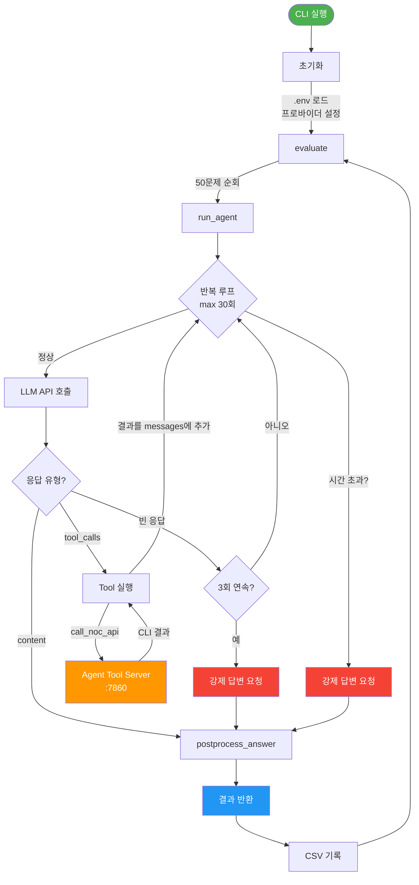
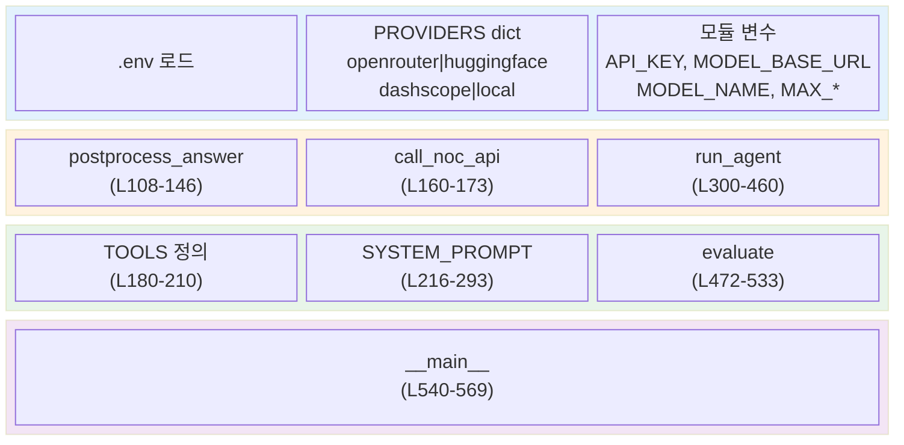
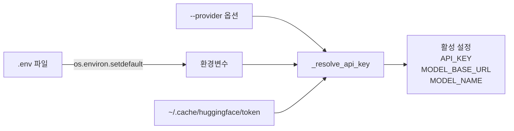
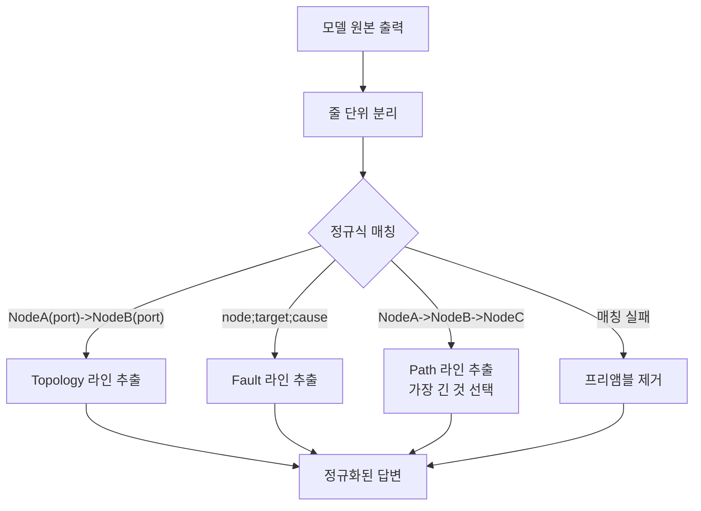
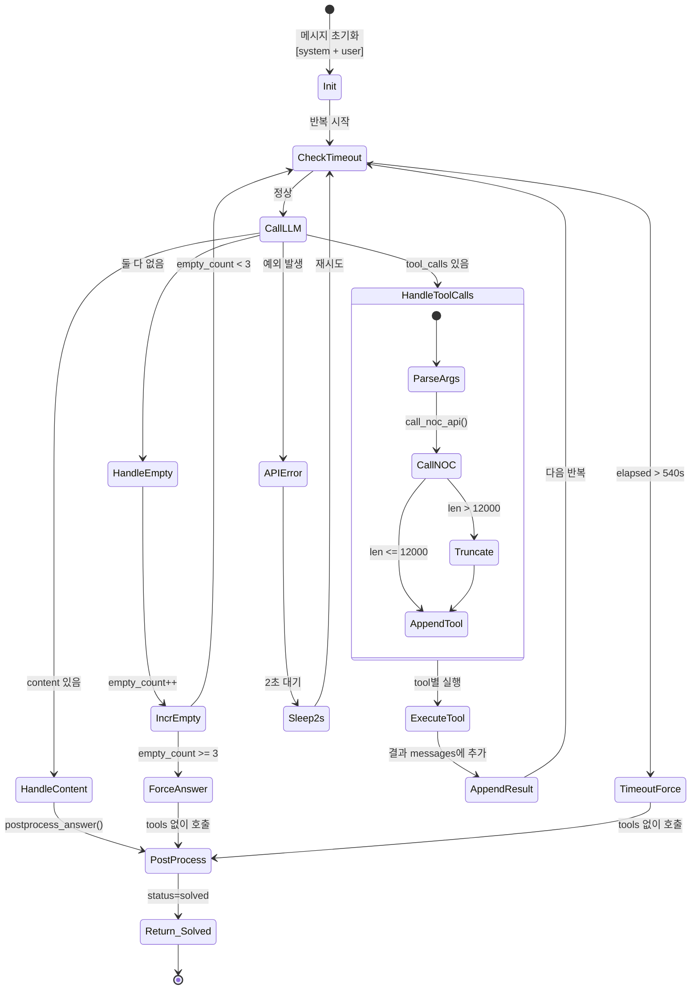
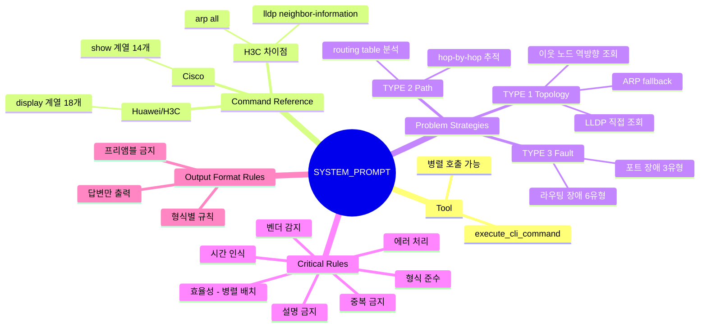
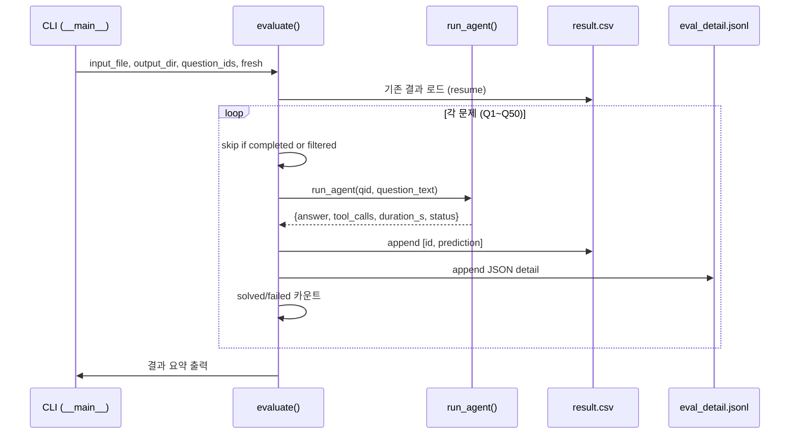
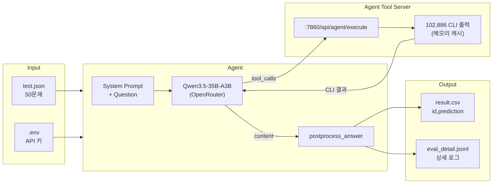

# Agent Architecture

> `agent/agent.py` 구조 설명서
> 최종 업데이트: 2026-04-14 | 버전: v4

## 1. 전체 흐름



## 2. 모듈 구조



## 3. 주요 컴포넌트 설명

### 3.1 설정 (Configuration) — L19~94



**프로바이더 우선순위**: CLI `--provider` > 환경변수 `LLM_PROVIDER` > 기본값 `openrouter`

| 프로바이더 | Base URL | 모델명 | 인증 |
|-----------|----------|--------|------|
| `openrouter` | openrouter.ai/api/v1 | qwen/qwen3.5-35b-a3b | `OPENROUTER_API_KEY` |
| `huggingface` | router.huggingface.co/novita/v3/openai | qwen/qwen3.5-35b-a3b | `HF_TOKEN` or token file |
| `dashscope` | dashscope.aliyuncs.com/compatible-mode/v1 | qwen3.5-flash | `DASHSCOPE_API_KEY` |
| `local` | localhost:8000/v1 | Qwen/Qwen3.5-35B-A3B | 불필요 |

### 3.2 후처리 (Post-processing) — L96~146



**정규식 패턴**:
- Topology: `^[\w-]+\([A-Za-z0-9/]+\)\s*->\s*[\w-]+\([A-Za-z0-9/]+\)$`
- Path: `^[\w-]+(?:\s*->\s*[\w-]+)+$`
- Fault: `^[\w-]+;[^;\n]+;[^;\n]+$`

### 3.3 에이전트 루프 (run_agent) — L300~460



**핵심 파라미터**:
| 파라미터 | 값 | 설명 |
|---------|-----|------|
| `MAX_ITERATIONS` | 30 | 최대 LLM 호출 횟수 |
| `MAX_TOKENS` | 16,000 | LLM 응답 최대 토큰 |
| `TIMEOUT_SECONDS` | 540 | 9분 타임아웃 (10분 제한 - 1분 마진) |
| `temperature` | 0.3 | 일반 호출 (tool use) |
| `temperature` | 0.1 | 강제 답변 호출 (정확도 우선) |
| 결과 truncate | 12,000자 | CLI 출력이 긴 경우 잘라냄 |

### 3.4 시스템 프롬프트 구조 — L216~293



### 3.5 배치 실행 (evaluate) — L472~533



## 4. 데이터 흐름



## 5. CLI 사용법

```bash
# 기본 실행 (OpenRouter, 전체 50문제)
python agent/agent.py

# 특정 문제만
python agent/agent.py --questions 1,2,7,39

# 프로바이더 변경
python agent/agent.py --provider local

# 새로 시작 (이전 결과 무시)
python agent/agent.py --fresh

# 입출력 경로 변경
python agent/agent.py -i data/test.json -o results/run1
```

## 6. 변경 이력

| 버전 | 날짜 | 변경 내용 |
|------|------|----------|
| **v1** | 2026-04-14 | 초기 구현. HF Inference(novita) + 단일 프로바이더. MAX_ITERATIONS=15 |
| **v2** | 2026-04-14 | 시스템 프롬프트 강화 (문제 유형별 전략). 빈 응답 복구 (3회 연속 시 강제 답변). MAX_ITERATIONS=30. 타임아웃 540초 후 강제 반환 |
| **v3** | 2026-04-14 | 멀티 프로바이더 지원 (openrouter/huggingface/dashscope/local). .env 파일 자동 로드. --provider CLI 옵션 |
| **v4** | 2026-04-14 | 출력 형식 정규화. `postprocess_answer()` 후처리 함수 추가. OUTPUT FORMAT RULES 프롬프트 섹션 추가 |
