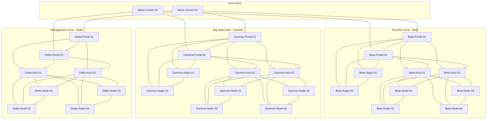
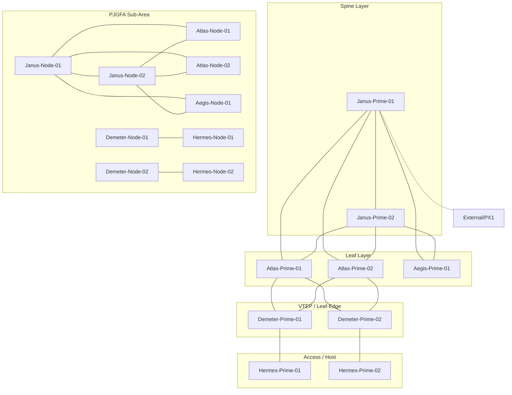

# Network Topology

## 전체 네트워크 구조 (Zone 간 연결)



## PJ Area 토폴로지



## 네트워크 계층 구조

```
┌─────────────────────────────────────────────────────────────────┐
│                        Core Layer                               │
│              Alpha-Center-01    Alpha-Center-02                  │
├──────────┬──────────────────────────────┬───────────────────────┤
│ Beta     │         Gamma                │ Delta                 │
│ (Dev/Test)│       (Big Data)             │ (Management)          │
│          │                              │                       │
│ Portal-01│ Portal-01    Portal-02       │ Portal-01  Portal-02  │
│ Portal-02│ Aegis-01     Aegis-02        │                       │
│ Aegis-01 │ Axis-01      Axis-02         │ Axis-01    Axis-02    │
│ Aegis-02 │   │Node-01     │Node-01      │   │Node-01   │Node-01│
│ Axis-01  │   │Node-02     │Node-02      │   │Node-02   │Node-02│
│ Axis-02  │   │Node-03     │Node-03      │   │Node-03   │Node-03│
│  │Node-01│   │Node-04     │Node-04      │   │Node-04   │Node-04│
│  │Node-02│                              │                       │
│  │Node-03│                              │                       │
│  │Node-04│                              │                       │
└──────────┴──────────────────────────────┴───────────────────────┘

┌─────────────────────────────────────────────────────────────────┐
│                     PJ Area (VXLAN Fabric)                       │
│ Spine:  Janus-Prime-01 ──── Janus-Prime-02                      │
│ Leaf:   Atlas-Prime-01  Atlas-Prime-02  Aegis-Prime-01          │
│ VTEP:   Demeter-Prime-01              Demeter-Prime-02          │
│ Access: Hermes-Prime-01                Hermes-Prime-02          │
│                                                                  │
│ PJGFA Sub:  Janus-Node-01/02, Atlas-Node-01/02, Aegis-Node-01  │
│             Demeter-Node-01/02, Hermes-Node-01/02              │
└─────────────────────────────────────────────────────────────────┘
```
