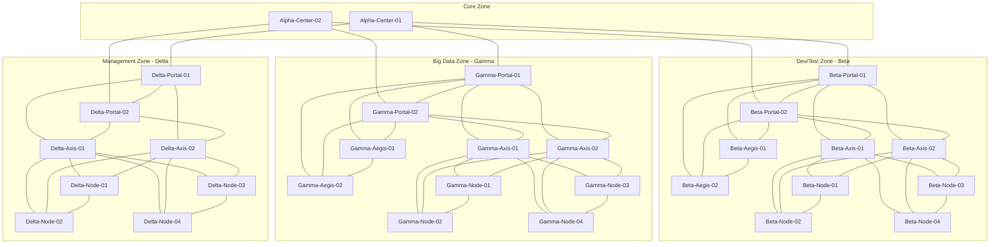
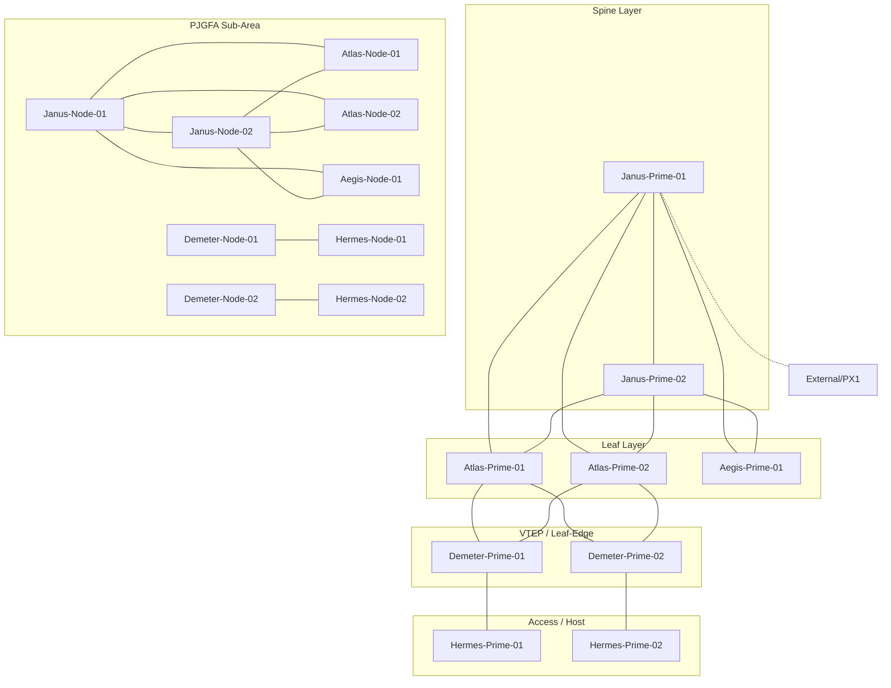

# Network Topology

## 개요

이 문서는 Zindi Telco Troubleshooting Challenge Track B (Phase 1)에서 사용되는 네트워크 토폴로지를 설명합니다. 챌린지에는 **두 개의 독립적인 네트워크**가 존재합니다.

| 네트워크 | 용도 | 노드 수 | 아키텍처 | 프로토콜 |
|----------|------|---------|----------|----------|
| **금융 네트워크** | 금융기관의 데이터센터 네트워크 | 32 | 전통적 3-Tier (Core-Aggregation-Access) | Static Route, OSPF |
| **클라우드 컴퓨팅 네트워크 (PJ Area)** | 클라우드 서비스 인프라 | 22 | Spine-Leaf VXLAN Fabric | VXLAN, BGP EVPN, OSPF |

### 두 네트워크의 관계
- **완전히 독립된 네트워크**: 금융 네트워크와 PJ Area는 직접 연결되어 있지 않습니다.
- **별도의 문제 세트**: Q1~Q28은 금융 네트워크, Q29~Q50은 PJ Area 문제입니다.
- **같은 장비 제조사**: 모든 장비는 Huawei CE12800 시리즈 (일부 Cisco PSS).
- PJ Area의 PX1 장비는 외부 네트워크(인터넷/WAN) 게이트웨이 역할.

---

## 1. 금융 네트워크 (32노드)

금융기관의 데이터센터를 시뮬레이션한 전통적 3-Tier 네트워크입니다.

### 구조
- **Core Layer** (코어): Alpha-Center-01/02 — 모든 Zone을 연결하는 백본 라우터
- **Aggregation Layer** (집선): Portal — Zone별 상위 집선 스위치, Aegis — 방화벽/보안 장비
- **Access Layer** (액세스): Axis — 서버 접속 스위치, Node — 서버/호스트

### Zone 설명

| Zone | 접두사 | 용도 | 구성 |
|------|--------|------|------|
| **Core** | Alpha-Center | 백본 라우팅, Zone 간 트래픽 중계 | 2대 (이중화) |
| **Dev/Test Zone** | Beta-* | 개발/테스트 환경 | Portal 2 + Aegis 2 + Axis 2 + Node 4 = 10대 |
| **Big Data Zone** | Gamma-* | 빅데이터 처리 환경 | Portal 2 + Aegis 2 + Axis 2 + Node 4 = 10대 |
| **Management Zone** | Delta-* | 운영 관리 환경 | Portal 2 + Axis 2 + Node 4 = 8대 |

### 라우팅
- Zone 내부: 직접 연결 (L2) + Static Route
- Zone 간: Alpha-Center를 경유하는 Static Route (예: Beta→Gamma는 Beta-Portal→Alpha-Center→Gamma-Portal)
- 일부 구간 OSPF 사용

### 해당 문제
- **Q1~Q6**: Topology (링크 복원)
- **Q7~Q16**: Path (경로 추적) — Zone 간 hop-by-hop 라우팅
- **Q17~Q28**: Fault (장애 진단) — 용의 노드에서 missing route, shutdown 등

## 전체 네트워크 구조 (Zone 간 연결)



---

## 2. 클라우드 컴퓨팅 네트워크 — PJ Area (22노드)

클라우드 서비스 인프라를 시뮬레이션한 현대적 Spine-Leaf VXLAN Fabric입니다.

### 구조
최신 데이터센터 아키텍처인 **Spine-Leaf** 구조를 채택하고, **VXLAN**으로 L2 오버레이 네트워크를 구성합니다.

| 계층 | 장비 | 역할 |
|------|------|------|
| **Spine** | Janus-Prime-01/02 | Fabric 백본 — Leaf 간 트래픽 중계 |
| **Leaf** | Atlas-Prime-01/02, Aegis-Prime-01/02 | Spine에 연결, VTEP으로 트래픽 라우팅 |
| **VTEP (Leaf-Edge)** | Demeter-Prime-01/02 | VXLAN 터널 종단점, L2/L3 게이트웨이 |
| **Access** | Hermes-Prime-01/02 | 서버/호스트 접속 스위치 |
| **External** | PX1 | WAN/인터넷 게이트웨이 (Janus-Prime-01과 연결) |

### PJGFA 서브영역
PJ Area 내의 별도 소규모 네트워크로, 동일한 Spine-Leaf 패턴을 따릅니다.

| 역할 | 장비 |
|------|------|
| Spine | Janus-Node-01/02 |
| Leaf | Atlas-Node-01/02, Aegis-Node-01 |
| VTEP | Demeter-Node-01/02 |
| Access | Hermes-Node-01/02 |

### 프로토콜
- **언더레이**: OSPF (Spine-Leaf 간 IP 라우팅)
- **오버레이**: VXLAN + BGP EVPN (L2 확장, MAC 학습)
- **VPN**: VRF 기반 테넌트 분리 (vpn1~vpn6)
- **VLAN**: 테넌트별 VLAN (10, 20, 30, 40, 50, 60 등)

### 데이터 흐름 (예: Hermes-Prime-01 → Hermes-Prime-02)
```
Hermes-Prime-01 (VLAN 10)
  → Demeter-Prime-01 (VTEP: VXLAN 캡슐화)
    → [OSPF 언더레이: Atlas-Prime → 경유]
      → Demeter-Prime-02 (VTEP: VXLAN 디캡슐화)
        → Hermes-Prime-02 (VLAN 10)
```

### 해당 문제
- **Q29~Q33**: Topology (링크 복원)
- **Q34~Q38**: Path (경로 추적) — VXLAN 오버레이/언더레이 경로
- **Q39~Q50**: Fault (장애 진단) — missing route, MAC 충돌, VXLAN 설정 오류 등

## PJ Area 토폴로지



---

## 3. 장비 공통 정보

### 제조사 및 모델
| 장비 | 제조사 | 모델 | OS |
|------|--------|------|----|
| 대부분 (Alpha~Hermes) | Huawei | CE12800 시리즈 | VRP V800R023C10 |
| PSS | Cisco | - | IOS |

### 데이터 소스 (NOC API가 제공하는 정보)
서버(server.py)는 `devices_outputs/{question_number}/{device_name}/` 디렉토리의 사전 생성된 텍스트 파일을 반환합니다. 각 문제마다 독립적인 데이터를 가지며, 같은 장비라도 문제에 따라 다른 설정/상태를 반환합니다 (장애 시뮬레이션).

### 연결 정보 확인 방법
1. **description 필드** (가장 신뢰): `display current-configuration`에서 `From_NodeA_PortX_To_NodeB_PortY`
2. **LLDP**: `display lldp neighbor brief` (일부 문제에서 "No permission" 반환)
3. **ARP**: `display arp`로 IP-MAC-포트 매핑

## 네트워크 계층 구조

```
┌─────────────────────────────────────────────────────────────────┐
│                        Core Layer                               │
│              Alpha-Center-01    Alpha-Center-02                  │
├──────────┬──────────────────────────────┬───────────────────────┤
│ Beta     │         Gamma                │ Delta                 │
│ (Dev/Test)│       (Big Data)             │ (Management)          │
│          │                              │                       │
│ Portal-01│ Portal-01    Portal-02       │ Portal-01  Portal-02  │
│ Portal-02│ Aegis-01     Aegis-02        │                       │
│ Aegis-01 │ Axis-01      Axis-02         │ Axis-01    Axis-02    │
│ Aegis-02 │   │Node-01     │Node-01      │   │Node-01   │Node-01│
│ Axis-01  │   │Node-02     │Node-02      │   │Node-02   │Node-02│
│ Axis-02  │   │Node-03     │Node-03      │   │Node-03   │Node-03│
│  │Node-01│   │Node-04     │Node-04      │   │Node-04   │Node-04│
│  │Node-02│                              │                       │
│  │Node-03│                              │                       │
│  │Node-04│                              │                       │
└──────────┴──────────────────────────────┴───────────────────────┘

┌─────────────────────────────────────────────────────────────────┐
│                     PJ Area (VXLAN Fabric)                       │
│ Spine:  Janus-Prime-01 ──── Janus-Prime-02                      │
│ Leaf:   Atlas-Prime-01  Atlas-Prime-02  Aegis-Prime-01          │
│ VTEP:   Demeter-Prime-01              Demeter-Prime-02          │
│ Access: Hermes-Prime-01                Hermes-Prime-02          │
│                                                                  │
│ PJGFA Sub:  Janus-Node-01/02, Atlas-Node-01/02, Aegis-Node-01  │
│             Demeter-Node-01/02, Hermes-Node-01/02              │
└─────────────────────────────────────────────────────────────────┘
```
