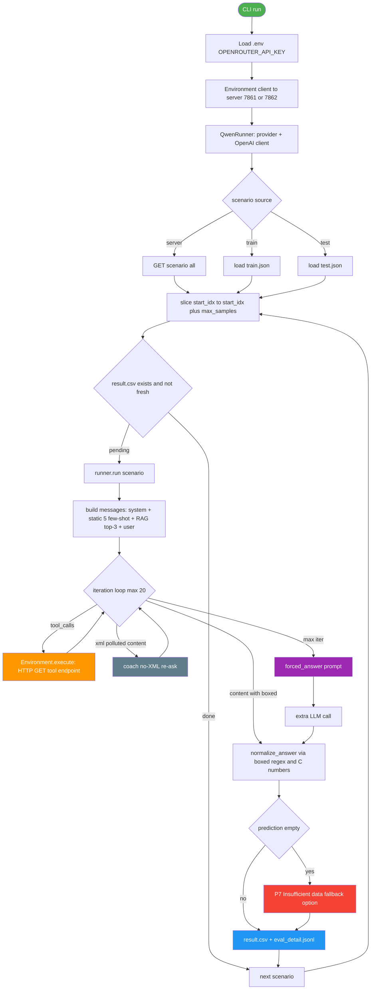

# Track A Agent Architecture

> 대상: `agent/track_a/agent.py` 구조 설명서
> 최종 업데이트: 2026-04-22 | 버전: v1 (Stage C Smoke 통과)

## 1. 전체 흐름



## 2. 디렉토리 구조

```
agent/track_a/
├── agent.py                 # 본 문서 대상 — Qwen runner 메인
├── prompts.py               # SYSTEM_PROMPT + FEW_SHOT_EXAMPLES + forced_answer_prompt
├── generate_submission.py   # result.csv → Zindi submission CSV (Track A 열)
├── eval_local.py            # IoU 기반 로컬 정확도 측정 (train.json answer 와 비교)
├── tools/
│   └── scenario_summary.py  # scenario inline data 추출 헬퍼 (Stage A)
├── results_smoke_1/         # 1 scenario 검증
├── results_smoke/           # Smoke 10 (test.json)
├── results_train_eval/      # train 10 (로컬 정확도)
├── results_pilot/           # Pilot 50 (대기)
├── results_batch_a/         # Batch A 200 (대기)
├── results_batch_b/         # Batch B 250 (대기)
└── submission/              # Zindi 제출 CSV
```

## 3. Provider 설정

`agent/track_a/agent.py:PROVIDERS` (Track B 의 PROVIDERS 일부 포팅):

| provider | base_url | model | env_key |
|----------|----------|-------|---------|
| **openrouter** (default) | `openrouter.ai/api/v1` | `qwen/qwen3.5-35b-a3b` | `OPENROUTER_API_KEY` |
| huggingface | `router.huggingface.co/novita/v3/openai` | `qwen/qwen3.5-35b-a3b` | `HF_TOKEN` |
| dashscope | `dashscope.aliyuncs.com/...` | `qwen3.5-flash` | `DASHSCOPE_API_KEY` |
| groq | `api.groq.com/openai/v1` | `llama-3.3-70b-versatile` | `GROQ_API_KEY` |
| local | `localhost:8000/v1` | `Qwen/Qwen3.5-35B-A3B` | (없음) |

CLI: `--provider openrouter --model <override>` 또는 `LLM_PROVIDER` env var.

## 4. Tool Server 통합

Track A 공식 server (`data/Track A/server.py`) 가 27개 tool 엔드포인트 노출 (`/tools` 에서 20개 동적 반환).

| Group | Tools |
|-------|-------|
| Throughput | `get_throughput_logs`, `get_user_plane_data` |
| Serving cell | `get_serving_cell_pci`, `get_serving_cell_rsrp`, `get_serving_cell_sinr`, `get_rbs_allocated_to_user` |
| Neighbor | `get_neighboring_cells_pci`, `get_neighboring_cell_rsrp` |
| Cell config | `get_cell_info`, `get_config_data`, `get_gnodeb_location`, `get_all_cells_pci` |
| User | `get_user_location` |
| Signaling | `get_signaling_plane_event_log` |
| KPI/MR | `get_kpi_data`, `get_mr_data` |
| 계산 유틸 | `judge_mainlobe_or_not`, `calculate_horizontal_angle`, `calculate_tilt_angle`, `calculate_pathloss`, `calculate_overlap_ratio` |
| Action | `optimize_antenna_gain` |
| Meta | `get_available_tools`, `health`, `get_all_scenario` |

각 tool 은 HTTP GET `/{endpoint}?param=value` 형식. `X-Scenario-Id` header 로 시나리오 격리.

서버 기동:
```bash
cd "data/Track A"
FASTAPI_PORT=7861 python3 server.py                       # test (default)
FASTAPI_PORT=7862 DATA_SPLIT=train python3 server.py      # 로컬 정확도 검증용
```

## 5. 프롬프트 전략 (`prompts.py`)

### SYSTEM_PROMPT 핵심 섹션

1. **역할** — 5G RAN optimization expert
2. **A3 Handover 공식**
   `Neighbor_RSRP > Serving_RSRP + (A3Offset × 0.5 dB) + (A3Hyst × 0.5 dB)`
3. **Tool 호출 권장 순서** — throughput → serving PCI → cell_info → RSRP/SINR → neighbors
4. **7-Pattern 진단 체크리스트** (P1~P7) — `.moai/plans/track-a-opus-solutions.md` §4 의 패턴 라이브러리
5. **답변 포맷 강제** — `\boxed{C#}` (single) / `\boxed{C#|C#|...}` (multiple, 오름차순)
6. **Protocol Rules** — 네이티브 tool_calls 사용 강제 (XML `<tool_call>` 금지), Insufficient data fallback 의무

### FEW_SHOT_EXAMPLES (5건)

| # | 출처 | 패턴 | 답 |
|---|------|------|-----|
| 1 | traces.json[0] | P1 Late handover | `\boxed{C9}` |
| 2 | train[0] | P2+P3 Ping-pong + Overshoot | `\boxed{C2|C8|C11|C16}` |
| 3 | train[1] | P5 Server issue | `\boxed{C9}` |

(traces.json[1] 와 train[5] 는 system prompt 의 패턴 설명에 흡수)

### forced_answer_prompt

답변 추출 실패 시 `single-answer` / `multiple-answer` 별 강제 양식 재요청. main.py 의 `free_mode` 분기와 동일 구조.

## 6. Resume / Idempotency

- `result.csv` (scenario_id, prediction) 헤더 + 행
- 기본 동작: 기존 result.csv 의 scenario_id 를 skip
- `--fresh` flag: 기존 결과 무시, 처음부터 재실행
- `--start-idx N --max-samples M`: scenario 슬라이스 (Pilot/Batch 분할 실행)

## 7. 평가 / 정확도 측정

`agent/track_a/eval_local.py result.csv --source train`:

- **IoU score**: `|pred ∩ truth| / |pred ∪ truth|`, single 정확 일치 = 1.0, multiple partial 부분 점수
- 통계: Total / Exact / Partial / Wrong / Empty / Mean IoU / Per-tag breakdown
- test.json 은 모든 answer 가 `"To be determined"` 이므로 실제 채점은 Zindi 서버에서만 가능

## 8. 진행 상태 (Stage C)

| 단계 | 결과 | 비고 |
|------|------|------|
| Smoke 10 (test) | 10/10 solved, empty 3건 | XML 오염 + reasoning 폭주 발견 → prompt P7 fallback 도입 |
| Train eval 10 (train) | exact 3/10, IoU 0.325, empty 0 | 게이트 통과 (≥0.3) |
| Pilot 50 (test) | 대기 | |
| Batch A/B (test) | 대기 | |

## 9. 알려진 한계

- Qwen3.5-35B-A3B 의 reasoning content 가 비는 경우 prediction 누락 → P7 fallback 으로 보완 (정답률 손실 가능)
- multiple-answer scenario 에서 P3 Overshoot 의 4개 옵션 정확 매칭 어려움 (train[0] 경우 부분 매칭)
- 30% wrong 비율은 P5 Server 와 P6 Excessive downtilt 의 SINR-양호 패턴 인식이 약하기 때문
