# Track A 무선 5G 네트워크 토폴로지

> Track A 시뮬레이션 도메인의 무선 RAN(Radio Access Network) 구조 설명
> Track B 의 IP 네트워크 토폴로지와는 완전히 다른 무선 RF 도메인
> 최종 업데이트: 2026-04-22

---

## 1. 개요

Track A 는 **5G NR (New Radio)** 무선 네트워크의 **드라이브 테스트 (Drive Test)** 시나리오를 다룬다. 사용자 단말 (UE) 이 차량에 탑재되어 일정 구역을 이동하면서 측정한 RF 데이터를 기반으로 throughput 저하의 원인을 진단하고 무선 파라미터 최적화를 결정한다.

각 scenario 는 다음 구조:
- **5개 내외의 5G 기지국 (gNodeB)** 이 일정 영역 커버
- 각 gNodeB 는 1~6개 **Cell (Sector)** 보유, 셀별 PCI/방향각/틸트
- UE 가 차량 이동 중 약 10초 구간의 throughput / RSRP / SINR 시계열 수집
- 그 중 일부 구간에서 throughput 이 < 100 Mbps 로 저하 → **이 저하 원인이 문제**

---

## 2. 핵심 구성 요소 용어

### 2.1 기지국과 셀 (Cell)

| 개념 | 설명 |
|------|------|
| **gNodeB ID** | 5G 기지국 고유 ID (예: `3225568`). 한 위치에 여러 cell sector 보유 |
| **Cell ID** | 한 gNodeB 내 sector 번호 (1, 2, 3, 4, ...). `gNodeB_Cell` 표기 (`3225568_1`) |
| **PCI** (Physical Cell ID) | 0~1007 의 RF layer 식별자. UE 가 신호 측정에 사용 |
| **ARFCN** | NR 채널 주파수 번호 (`504990` 대역 = 3500 MHz n41) |
| **DL ARFCN** | Downlink 캐리어 주파수 번호 |

### 2.2 안테나 파라미터

| 파라미터 | 단위 | 의미 | 범위 |
|---------|------|------|------|
| **Mechanical Azimuth** | 도 | 안테나가 물리적으로 향한 방위각 (북=0, 동=90, 남=180, 서=270) | 0~360 |
| **Mechanical Downtilt** | 도 | 물리적으로 빔이 아래로 기울어진 각도 | 0~15 |
| **Digital Tilt** | 도 | 빔 forming 으로 추가 적용된 downtilt | 0~12 |
| **Total Downtilt** | 도 | `Mechanical Downtilt + Digital Tilt`. ≥20° 이면 매우 좁은 영역만 커버 |
| **Transmission Power** | dBm | 송신 전력 (보통 11~30, max=32) |
| **TxRx Mode** | — | 안테나 구성 (예: `64T64R` = 64 송수신 안테나, massive MIMO) |
| **Height** | m | 안테나 설치 고도 |
| **BW [MHz]** | MHz | 채널 대역폭 (보통 100M) |

### 2.3 RF 측정값

| 측정값 | 단위 | 의미 | 정상 범위 |
|--------|------|------|----------|
| **SS-RSRP** (Synchronization Signal Reference Signal Received Power) | dBm | UE 가 측정한 신호 강도 | -60 (강함) ~ -120 (매우 약함) |
| **SS-SINR** (Signal-to-Interference plus Noise Ratio) | dB | 신호 대 간섭+잡음 비율 | -5 (간섭) ~ +30 (양호). > 10 = healthy |
| **DL Throughput** | Mbps | 다운링크 전송속도 | 0 ~ 1000+ |
| **CCE Fail Rate** | 비율 | Control Channel Element 실패율 | 정상 < 0.5 |
| **Avg MCS** | 인덱스 | Modulation and Coding Scheme 평균 | 0~28 |
| **Initial / Residual BLER** | % | Block Error Rate, 재전송 전후 | < 10% |

---

## 3. Handover 메커니즘 (가장 자주 등장하는 진단 포인트)

### 3.1 A2 / A3 / A5 Event 정의 (3GPP TS 38.331)

| 이벤트 | 정의 | 활용 |
|--------|------|------|
| **A2** | `Serving < Threshold` | UE 가 inter-frequency 측정 시작 |
| **A3** | `Neighbor > Serving + Offset + Hyst` | Intra-frequency handover 트리거 |
| **A5** | `Serving < Threshold1 AND Neighbor > Threshold2` | Inter-frequency handover 트리거 |

### 3.2 A3 Handover 공식 (Track A 의 핵심)

```
A3 trigger 조건: Neighbor_RSRP  >  Serving_RSRP  +  A3Offset×0.5 dB  +  A3Hyst×0.5 dB
                                                  └─────────┬─────────┘
                                                       실효 dB 임계
```

Cell config 의 `IntraFreqHoA3Offset` 와 `IntraFreqHoA3Hyst` 는 **0.5 dB 단위 정수**:

| Config 값 | 실효 dB |
|-----------|---------|
| 2  | 1.0 dB |
| 4  | 2.0 dB |
| 6  | 3.0 dB |
| 10 | 5.0 dB |

A3Offset 이 너무 높으면 Late handover (UE 가 약한 셀에 머물러 throughput 저하).
너무 낮으면 Ping-pong (인접 두 셀 사이를 빈번하게 왕복).

### 3.3 Inter-frequency 임계값

| 파라미터 | 단위 | 일반 값 | 의미 |
|----------|------|---------|------|
| `CovInterFreqA2RsrpThld` | dBm | -105 | A2 트리거 RSRP 임계 |
| `InterFreqA2Hyst` | 0.5dB | 2 | A2 히스테리시스 |
| `CovInterFreqA5RsrpThld1` | dBm | -105 | A5 Serving 임계 |
| `CovInterFreqA5RsrpThld2` | dBm | -100 | A5 Neighbor 임계 |
| `InterFreqHoEventType` | 문자열 | `EVENT_A5` | Inter-frequency handover 트리거 이벤트 |

### 3.4 PdcchOccupiedSymbolNum

PDCCH (Physical Downlink Control Channel) 가 OFDM symbol 몇 개를 점유하는가.

- `1SYM`: control 채널 적게 → user data 공간 많음 → throughput 양호
- `2SYM`: control 채널 더 많음 → user data 공간 감소 → 그러나 control 부하 큰 셀에서 필요

---

## 4. 시나리오 데이터 구조

각 train/test scenario `data` 필드 (모두 inline pipe-separated string):

| 필드 | 내용 | 예시 행 수 |
|------|------|-----------|
| `user_plane_data` | 시계열 RF + Throughput + Top 5 Neighbor 측정 | 12 |
| `network_configuration_data` | 이 scenario 내 5개 cell 의 안테나 설정 | 5 |
| `signaling_plane_data` | A2/A3/A5 + Handover Attempt 이벤트 | 10~25 |
| `traffic_data` | 시간당 Cell 별 PRB / Throughput / CCE | 4~5 |
| `mr_data` | Mobile Report 샘플 (다른 사용자) | 5~10 |
| `notes` | 운영자 메모 (대부분 비어있음) | — |
| `collection_method` | "real" 또는 "synthesized" | — |

서버는 `X-Scenario-Id` 헤더로 시나리오 격리하여 같은 tool 호출이 다른 데이터 반환.

---

## 5. 토폴로지 시각화 (예시: train[0])

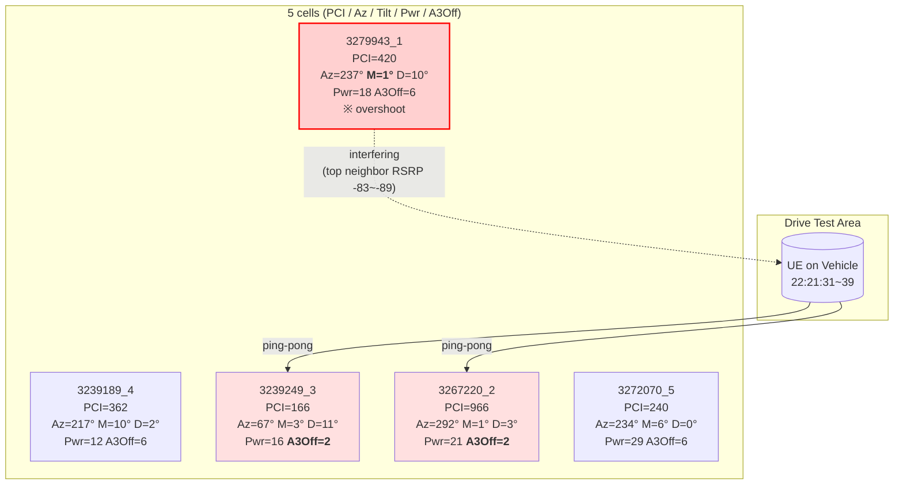

이 scenario 의 정답 (`C2|C8|C11|C16`):
- PCI 420 overshoot → Power down + Tilt down + A3 Offset up
- PCI 166/966 ping-pong → 한쪽 A3 Offset up

---

## 5-bis. 7-pattern 실측 시각화 갤러리

각 패턴(P1~P7)의 대표 train 시나리오를 실제 lon/lat 좌표 + sector beam 부채꼴 + UE 시계열(Throughput/RSRP/SINR/Serving PCI) 로 렌더한 이미지다. 부채꼴 **방향**은 Mechanical Azimuth, **반경**은 Tx Power 에 비례, **색상**은 Total Downtilt (green=wide cover, red=≥20° narrow). 라벨은 안테나 null 방향(beam 반대쪽)에 배치되어 UE 경로와 겹치지 않는다.

재생성 스크립트: `agent/track_a/viz/render_pattern_topology.py`
```bash
python agent/track_a/viz/render_pattern_topology.py
```

### P1 Late Handover — train[2], answer=`C16`

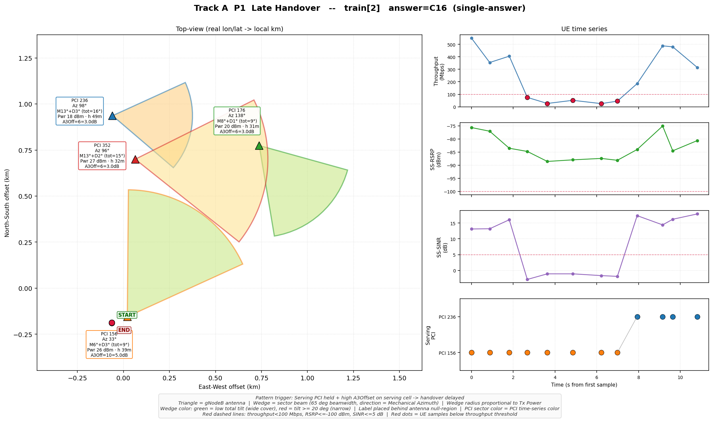

서빙 셀의 A3Offset 이 과도하게 높아 UE 가 강한 neighbor 로 handover 못 하고 약해지는 서빙 셀에 머무르는 전형. Serving PCI 가 단일값으로 유지되며 throughput 만 저하하는 패턴.

### P2 Ping-pong — train[0], answer=`C2|C8|C11|C16`

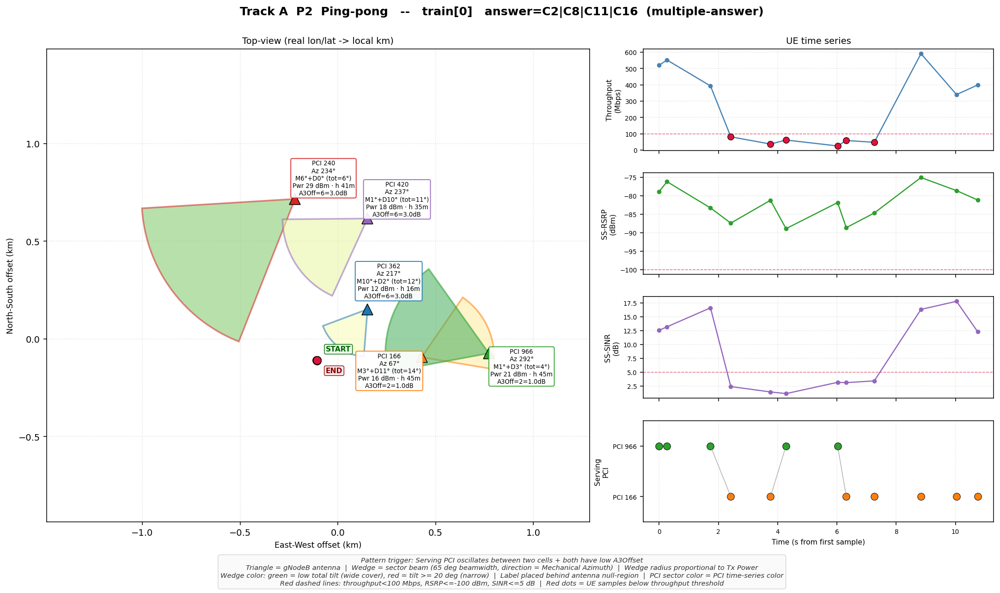

Serving PCI 시계열에서 **PCI 966 ↔ 166** 왕복이 눈으로 직접 확인된다. 양쪽 모두 `A3Off=2=1.0 dB` 로 과도하게 낮아 handover 임계값 근처에서 셀이 계속 바뀜. 3~7 초 구간 SINR < 5 dB 간섭으로 throughput 급락. 이 시나리오는 추가로 PCI 420 overshoot 요소도 포함되어 multiple-answer.

### P3 Overshoot — train[10], answer=`C3|C12`

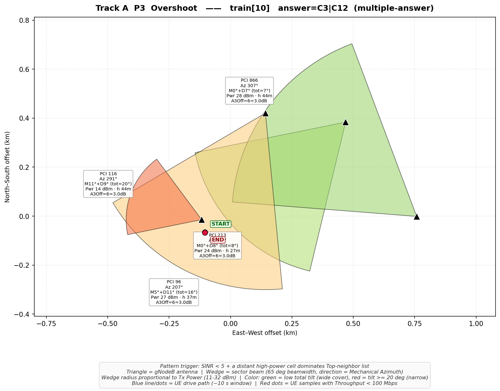

SINR 가 음수에 가까운 깊은 간섭 구간이 관찰된다. 원거리 high-power cell 의 빔이 UE 영역까지 overshoot 하여 serving 셀 신호와 충돌. 조치는 overshooting cell 의 **Power down + Tilt down + A3 Offset up** 3-tuple.

### P4 Coverage Hole — train[17], answer=`C3|C14`

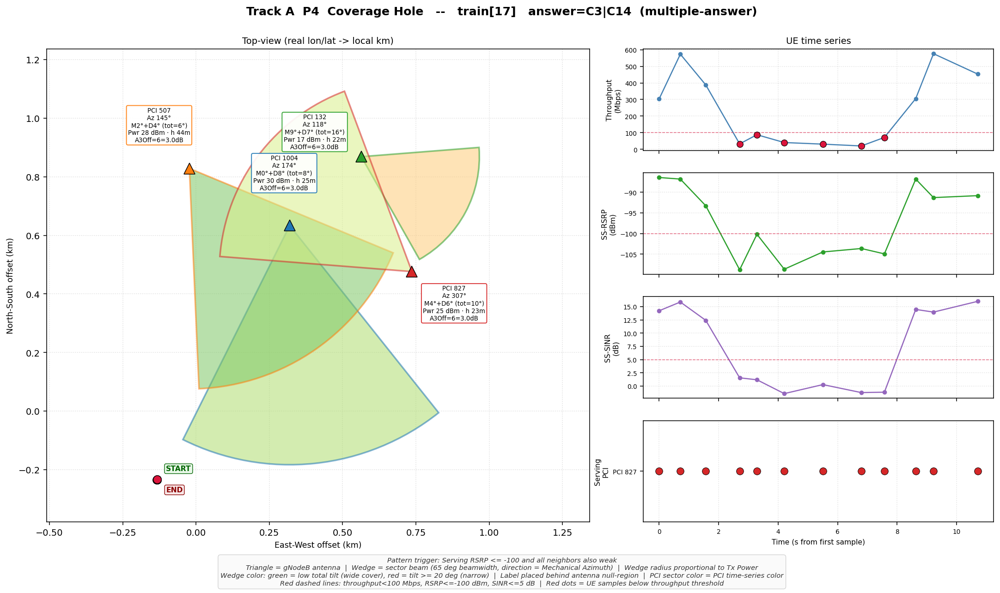

Serving RSRP 가 -100 dBm 근처까지 떨어지고, Top neighbor 들도 모두 약한 "전반 커버리지 부족" 패턴. Azimuth 조정 + Transmission Power 증가 조합으로 해소.

### P5 Server Issue — train[1], answer=`C9`

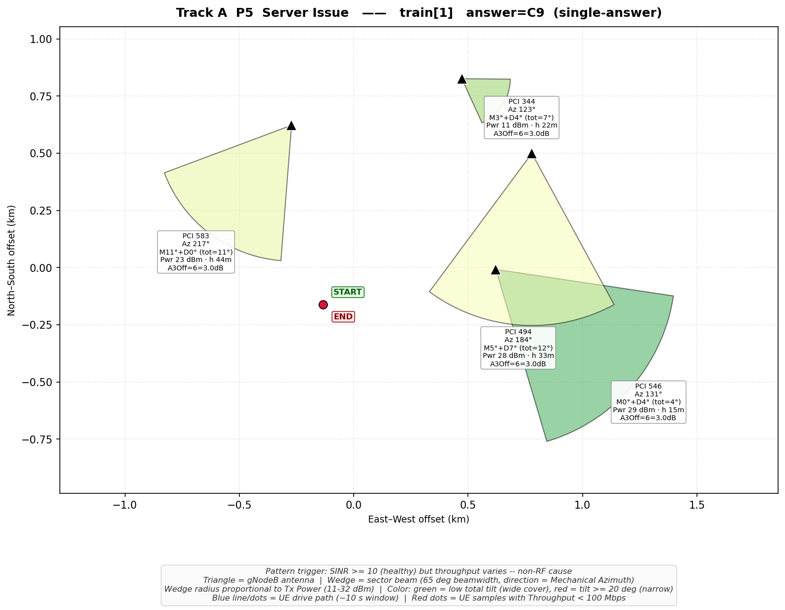

RSRP/SINR 은 모두 양호 범위인데 throughput 만 불안정하게 변동. 무선 측 anomaly 가 없으므로 `Check test server and transmission issues` 가 유일한 정답.

### P6 Excessive Downtilt — train[4], answer=`C3`

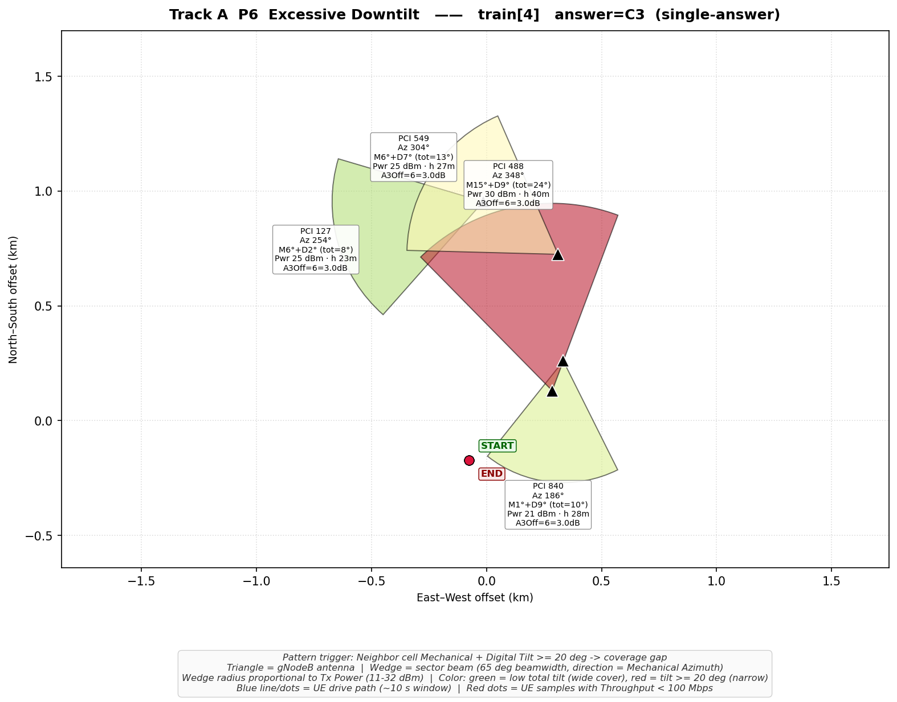

PCI 488 cell 의 `Mechanical 15° + Digital 9° = total 24°` 로 빔이 기지국 바로 아래만 커버(빨간 narrow 부채꼴). UE 영역을 커버해야 할 neighbor 가 커버를 못 하는 구조. **Lift tilt** 조치가 정답. Opus 도 초기에 P5 Server 로 오진할 정도로 까다로운 패턴.

### P7 Insufficient Data — train[6], answer=`C9`

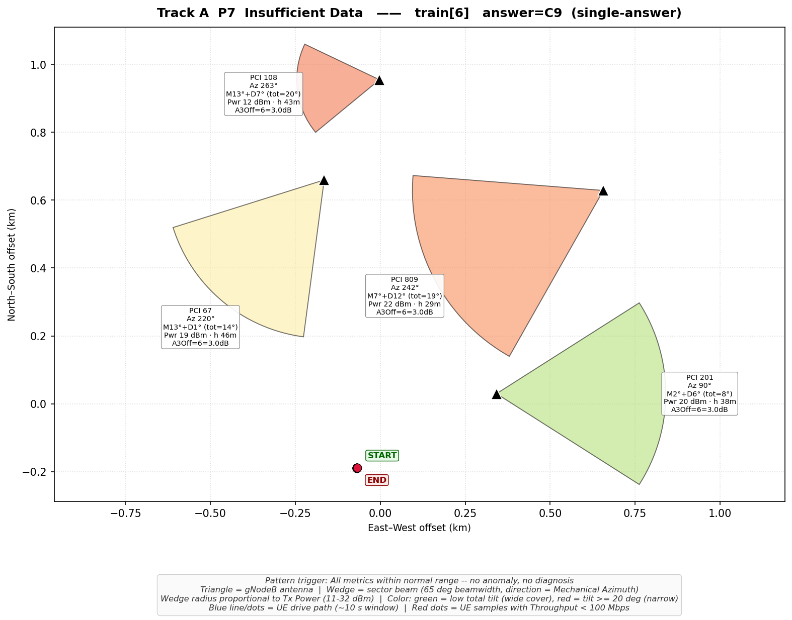

모든 지표가 정상 범위, serving PCI 안정, SINR ≥ 10, RSRP > -100, throughput 변동도 미미. 어떤 패턴도 매칭되지 않으므로 억지 진단 금지 — `Insufficient data; more data is needed for judgment.` 가 안전한 정답. 에이전트의 fallback 동작 근거가 되는 패턴.

---

## 5-ter. 신규 패턴 (P8~P10) — 2026-04-24 추가

train 2000 전수 분석 결과, 기존 7-pattern(P1~P7)이 **전체의 63.8%만 커버**하고 36.2%(725건)가 누락되는 것을 발견. 다음 3개 패턴을 추가하여 10-pattern 라이브러리로 확장.

### P8 PDCCH Resource Issue — train[13], answer=`C15`

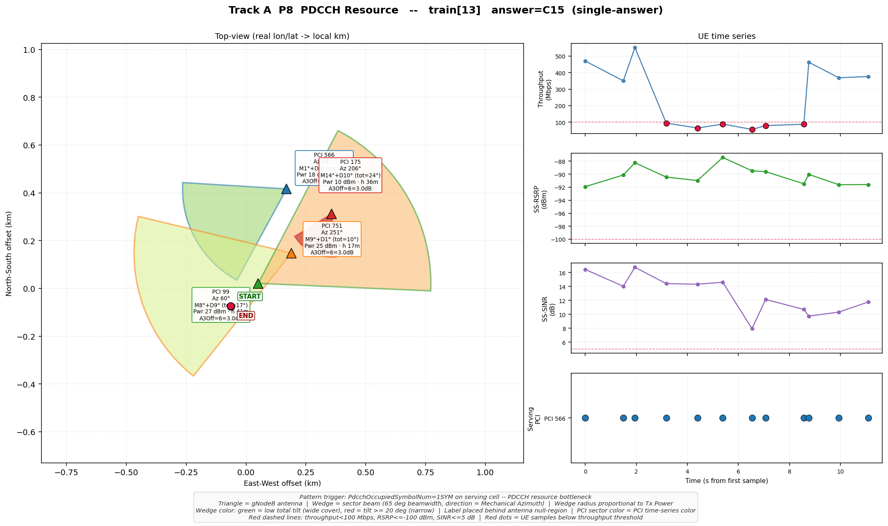

- **빈도**: train 2000 중 240건 (12.0%), 전부 single-answer
- **데이터 시그니처**: SINR/RSRP 대체로 양호, P1~P6 패턴 어디에도 해당 안 됨. 서빙 셀의 PdcchOccupiedSymbolNum이 "1SYM"으로 설정되어 control channel 리소스 부족 가능. 시각화에서 throughput이 100 Mbps 근처로 간헐적 저하되지만 SINR은 8~16 dB (양호), RSRP는 -88~-92 dBm, Serving PCI 566 고정 — RF 문제가 아닌 control channel 리소스 병목.
- **정답 라벨**: `Modify PdcchOccupiedSymbolNum to 2SYM for <serving cell>`
- **진단 핵심**: 다른 패턴이 매칭되지 않을 때, cell config에서 PdcchOccupiedSymbolNum 확인. 1SYM이면 리소스 부족 가능 → 2SYM으로 변경.

### P9 Missing Neighbor Relationship — train[20], answer=`C2`

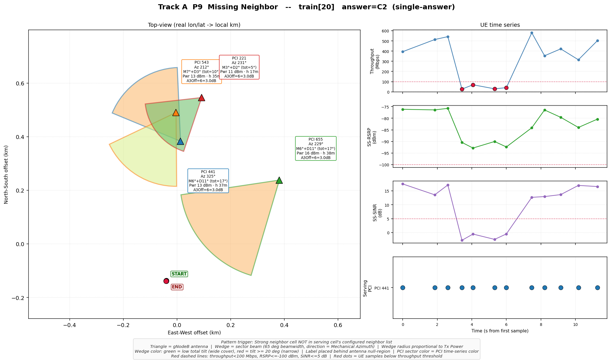

- **빈도**: train 2000 중 240건 (12.0%), 전부 single-answer
- **데이터 시그니처**: 강한 이웃 셀(RSRP ≥ -90 dBm)이 drive test에서 반복 관측되지만, 서빙 셀의 설정된 neighbor list (PCell Neighbor Cell)에 해당 PCI가 **없음**. 따라서 핸드오버가 불가. 시각화에서 throughput 저하 구간에서 SINR이 0 dB까지 급락 — 강한 이웃(3266648_3)으로 핸드오버가 필요하지만 neighbor list에 없어 서빙 셀(PCI 441) 고정.
- **정답 라벨**: `Add neighbor relationship between <serving cell> and <that neighbor>`
- **진단 핵심**: get_cell_info로 serving cell의 neighbor list 확인 → get_neighboring_cells_pci로 실제 관측 이웃 확인 → 관측은 되지만 설정에 없는 셀이 있으면 P9.

### P10 Inter-Frequency Coverage Threshold Too High — train[15], answer=`C14`

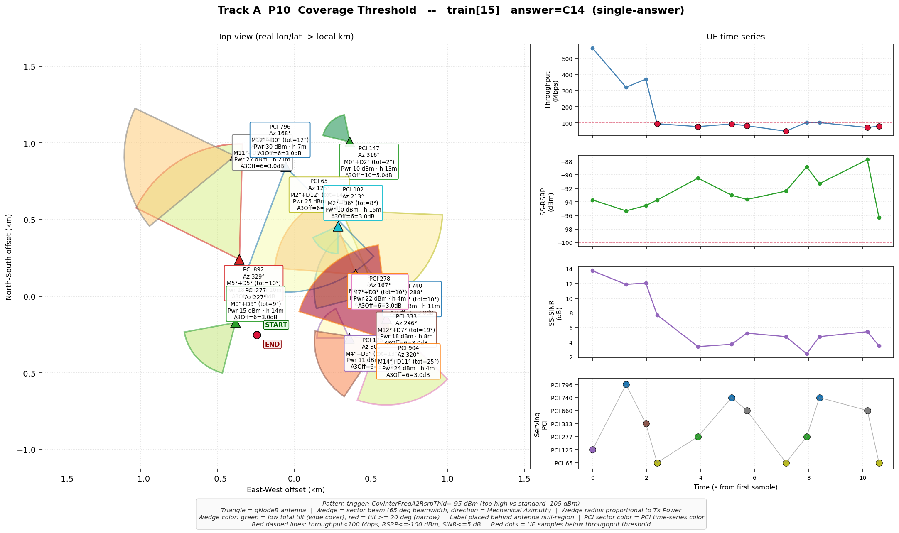

- **빈도**: train 2000 중 245건 (12.2%), 전부 single-answer
- **데이터 시그니처**: 서빙 셀의 `CovInterFreqA2RsrpThld`가 **-95 dBm** 수준 (비-P10 시나리오는 -105 dBm). 높은 임계값은 inter-frequency 커버리지 측정이 너무 보수적으로 트리거되어 UE가 대안 주파수를 감지하기 어려움. 시각화에서 13개 셀 밀집 환경, 다수 핸드오버 발생(PCI 7개 전환), throughput이 100 Mbps 미만으로 지속 — 복잡한 multi-cell 환경에서 inter-frequency threshold 조정이 필요.
- **정답 라벨**: `Decrease CovInterFreqA2RsrpThld and CovInterFreqA5RsrpThld1 thresholds for <cell>`
- **진단 핵심**: get_cell_info → CovInterFreqA2RsrpThld가 -105 보다 유의미하게 높으면 (예: -95, -100) P10.

### 10-Pattern 커버리지 요약

| 패턴 | 빈도 | 비율 | tag |
|------|------|------|-----|
| P1 Late HO | 231 | 11.6% | single |
| P3 Overshoot | 157 | 7.8% | multi |
| P4 Coverage | 142 | 7.1% | multi |
| P5 Server | 239 | 11.9% | single |
| P6 Excessive Tilt | 254 | 12.7% | single |
| P7 Insufficient | 252 | 12.6% | single |
| **P8 PDCCH** | **240** | **12.0%** | **single** |
| **P9 Add Neighbor** | **240** | **12.0%** | **single** |
| **P10 Threshold** | **245** | **12.2%** | **single** |
| **합계** | **2000** | **100%** | — |

---

## 6. 정답 옵션 카테고리

22개 안팎의 옵션 (C1~C22) 은 거의 모두 다음 카테고리 중 하나:

| 카테고리 | 동작 | 자주 매칭되는 패턴 |
|---------|------|-------------------|
| Tilt 조정 | `Lift` (들어올림) / `Press down` | P3 Overshoot, P6 Excessive downtilt, P4 Coverage hole |
| Azimuth 조정 | `Adjust azimuth by N degrees` | P3 Overshoot 방향, P4 Coverage hole |
| 송신 전력 | `Increase` / `Decrease transmission power` | P3 Overshoot, P4 Coverage hole |
| A3 Offset | `Increase` / `Decrease A3 Offset threshold` | P1 Late handover, P2 Ping-pong, P3 Overshoot |
| Cov Threshold | `Decrease CovInterFreqA2RsrpThld and CovInterFreqA5RsrpThld1` | Inter-frequency 보강 |
| PdcchOccupiedSymbolNum | `Modify to 2SYM` | 컨트롤 채널 부하 |
| Neighbor 관계 | `Add neighbor relationship between X and Y` | 누락된 handover 후보 추가 |
| 서버/전송 | `Check test server and transmission issues` | P5 Server issue (SINR 양호 + throughput 변동) |
| 데이터 부족 | `Insufficient data; more data is needed for judgment.` | P7 — 어떤 패턴도 매칭 안 됨 |

각 scenario 의 옵션은 위 카테고리에서 무작위로 22개 정도 선택. 동일 cell 에 대해 상반된 동작 (예: tilt up vs tilt down) 이 함께 등장.

---

## 7. 다른 공식 참고자료

본 문서의 RF 공식과 임계값은 3GPP TS 38.331 (Radio Resource Control) 와 38.213 (Physical Layer Procedures for Control) 에 근거. Track A 시뮬레이터의 정확한 모델은 `data/Track A/server.py` 에 구현.

관련 문서:
- 패턴 라이브러리: `.moai/plans/track-a-opus-solutions.md` §4 (P1~P7) + `03-2_topology.md` §5-ter (P8~P10)
- 문제 분석: `03-3_problems.md`
- 에이전트 구조: `03-1_architecture.md`
