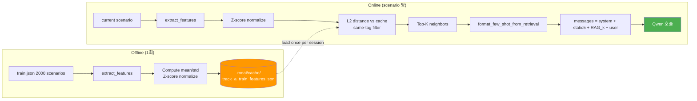

# Track A RAG 동작 구조

> 대상: `agent/track_a/rag.py` + `agent/track_a/agent.py`
> 최종 업데이트: 2026-04-23 (22-dim 확장 + feature_hint + Zindi 0.3174 검증 완료)
> 효과 추이: v1 baseline 0.160 → v3 RAG (14-dim) 0.220 → **v4 RAG (22-dim + feature_hint) 0.3173 (+44% vs v3, +98% vs baseline)**
> Zindi 검증: submission_v2_sc 업로드 → **public 0.3174 (로컬 IoU 0.3173 과 거의 일치)**

---

## 1. 왜 RAG 인가

Qwen3.5-35B-A3B 단독은 train 50 샘플에서 **IoU 0.160, exact 8/50 (16%)** 로 저성능.
주된 오답 원인은 **패턴 인식 실패** — 정적 7-pattern system prompt + 5 few-shot 만으로는
다양한 drive-test 시나리오의 미세한 차이를 학습시키기 부족함.

**핵심 아이디어**: train 2000 은 answer 포함 dataset → **현재 풀려는 scenario 와 가장 유사한
train scenario 를 찾아 그 정답을 few-shot 으로 주입**하면 Qwen 이 비슷한 패턴에서 정답을 전이.

Challenge 규칙 상 **Qwen 만 제출 가능** 이므로 RAG 는 Qwen 의 prompting 만 확장 (모델 교체 X).

---

## 2. 전체 파이프라인



---

## 3. Feature Extraction (22-dim, P2-1 확장)

각 scenario 를 22개 숫자로 요약. 핵심 원칙: **RF 진단에 필요한 핵심 지표 + pattern-level discriminator**.

| idx | 특징 | 설명 | 패턴 연관 |
|-----|------|------|-----------|
| 0 | TP_min | throughput 최저 | degradation 심도 |
| 1 | TP_max | throughput 최고 | 기저 성능 |
| 2 | TP_avg | throughput 평균 | 전반적 수준 |
| 3 | TP_drop_ratio | (max-min)/max | 저하 정도 (0~1) |
| 4 | SINR_min | 최소 SINR | **P3 간섭 감지 (<5 dB)** |
| 5 | SINR_max | 최대 SINR | |
| 6 | SINR_avg | 평균 SINR | **P5 healthy 판단 (≥10)** |
| 7 | RSRP_min | 최소 RSRP | **P4 coverage hole 감지 (≤-100)** |
| 8 | RSRP_max | 최대 RSRP | |
| 9 | RSRP_avg | 평균 RSRP | |
| 10 | unique_pci | 서빙 PCI 변화 수 | **P2 ping-pong 감지 (≥2)** |
| 11 | n_cells | scenario 내 cell 수 | |
| 12 | avg_a3_offset | 평균 A3 offset | **P1 late HO 감지 (≥10)** |
| 13 | max_total_tilt | Mechanical + Digital 최대 | **P6 excessive downtilt (≥20)** |
| **14** | **SINR_variance** | SINR 분산 | **P5 server issue 감지 (variance↑ + SINR_avg≥10)** |
| **15** | **pci_transitions** | 연속 PCI 변화 횟수 | **P2 ping-pong 강도 (≥2)** |
| **16** | **a3_variance** | 셀 간 A3Offset 분산 | 셀별 편차 분석 |
| **17** | **tilt_range** | max_total_tilt - min_total_tilt | **P3 vs P6 구분** |
| **18** | **max_cell_power** | 전 셀 최대 송신 전력 | **P4 coverage hole (<30 지표)** |
| **19** | **min_cell_power** | 전 셀 최소 송신 전력 | P3 overshoot (≥25 확인) |
| **20** | **tp_recovery_flag** | 저점→회복 패턴 존재 | **P5 server issue 지표 (1=있음)** |
| **21** | **serving_rsrp_spread** | RSRP_max - RSRP_avg | **P3 overshoot 지표 (≥ threshold)** |

**구현**: `agent/track_a/rag.py:extract_features()` — scenario.data 의 `user_plane_data`,
`network_configuration_data` inline CSV 를 파싱하여 위 22개 값 추출.
`_variance()`, `_pci_transitions()`, `_throughput_recovery_flag()` 헬퍼 함수로 계산.

### 3.1 예시 (train[0], multi-answer C2|C8|C11|C16)

```
[25.61, 591.14, 259.29, 0.957,              # [0-3] TP: 25~591, drop 95.7%
 1.15, 17.78, 8.63,                         # [4-6] SINR: 1.15 (간섭) ~ 17.78, avg 8.63
 -88.87, -75.03, -82.12,                    # [7-9] RSRP: -89~-75 정상
 2.0, 5.0,                                  # [10-11] unique_pci=2 (ping-pong), cells=5
 4.4, 14.0,                                 # [12-13] A3Off 평균 4.4, 최대 tilt 14
 40.77, 3.0, 3.84, 10.0,                    # [14-17] SINR_var 40.77 (노이지!), PCI trans 3, A3 분산 3.84, tilt range 10
 0.0, 0.0, 1.0, 7.09]                       # [18-21] power max 0 (데이터 없음), power min 0, tp_recovery=YES, rsrp spread 7
```

→ SINR_var 40.77 (분산 매우 큼 → 순간 interference) + PCI transitions 3 (ping-pong 강함) + tp_recovery=1
(저점→회복 전형적 P5/P3 혼합). 정답 `C2|C8|C11|C16` 은 P3 overshoot + P2 ping-pong 혼합 패턴에 부합.

---

## 4. Precompute (1회 실행)

```bash
python agent/track_a/rag.py --precompute
```

**작업**:
1. train 2000 scenarios 순회 → 각 scenario 의 22-dim raw feature 추출
2. dataset-wide 통계 계산: `mean[22]`, `std[22]`
3. **Z-score 정규화**: `normalized[i] = (feature[i] - mean[i]) / std[i]`
   (차원별 scale 차이 무시 — TP 수백 vs SINR 한자릿 혼재 문제 해결)
4. `.moai/cache/track_a_train_features.json` 저장 (~1.54 MB, 이전 14-dim 1.13 MB 대비 +37%)
5. 이전 14-dim cache 는 `track_a_train_features.json.bak.14dim` 로 백업 (롤백 대비)

**캐시 구조**:
```json
{
  "_stats": {"mean": [22 floats], "std": [22 floats]},
  "entries": [
    {"idx": 0, "scenario_id": "08e221e5-...", "tag": "multiple-answer",
     "answer": "C2|C8|C11|C16",
     "features": [22 raw],
     "normalized": [22 z-scored]}, ...
  ]
}
```

모듈 상수 `FEATURE_DIM = 22` 로 관리 — 이후 차원 확장 시 `extract_features()` 와
`_compute_stats()` 만 동기화.

---

## 5. Online Retrieval

scenario 마다 다음 절차 (runtime ~1 ms):

1. **Feature extraction**: 현재 scenario → 14-dim raw
2. **Normalize**: 캐시의 `_stats` 로 Z-score 변환
3. **Distance**: 모든 train entry 에 대해 L2 distance 계산
4. **Filter**: `same_tag_only=True` 이면 **동일 tag** (single↔single, multi↔multi) 만 후보
5. **Sort**: distance 오름차순, 상위 K=3 (default) 선택
6. **Exclude**: train 에서 query 시 `exclude_sid` 로 자기 자신 제외

### 5.1 예시 (test[0])

```
Query: 80e3aa96-... (tag=single-answer)
Features (22-dim): [29.24, 522.29, 310.10, 0.944,
                    -3.89, 17.52, 8.98,
                    -94.27, -75.21, -82.89,
                    1.0, 4.0, 6.0, 21.0,
                    ...(+8 dims: SINR_var, pci_trans, a3_var, tilt_range,
                                 max_power, min_power, tp_recovery, rsrp_spread)]

Top-3 neighbors (same-tag single, L2 distance in 22-dim Z-score space):
  d=0.71    train[xxx]   answer=C19
  d=0.75    train[yyy]   answer=C21
  d=0.98    train[zzz]   answer=C10
```

**변화**: 14→22 dim 전환으로 distance 절대값은 증가했지만 **neighbor ranking 이 변화**하여
pattern-level similarity (SINR variance, PCI transition 등) 가 반영되는 retrieval 로 개선.

---

## 6. Few-shot Injection 포맷 (P2-3 feature_hint 반영)

검색된 3개 neighbor 를 user/assistant 쌍으로 변환 (`format_few_shot_from_retrieval`).
**토큰 절약** 을 위해 full reasoning 생략, **P2-3** 으로 pattern hint 주입 (50 토큰 이하).

```
--- user ---
[Similar scenario — feature-space distance 0.71]
Analyze 5G network drive test data.
Identify actionable steps...
Options:
C1: Increase transmission power for 3225568_1
C2: Decrease A3 Offset threshold for 3265067_3
...

--- assistant ---
(Similar pattern: ping-pong (PCI trans=3, low A3=2.5)) \boxed{C19}
```

### 6.1 `_feature_hint()` 규칙

`agent/track_a/rag.py:_feature_hint()` 가 train scenario 의 22-dim feature 에서
Pattern 판정을 도출:

| 조건 | 힌트 |
|------|------|
| pci_transitions ≥ 2 AND avg_a3 ≤ 3 | `ping-pong (PCI trans=N, low A3=X)` |
| unique_pci == 1 AND avg_a3 ≥ 8 | `late handover (stable PCI, high A3=X)` |
| sinr_avg ≤ 5 AND max_power ≥ 25 | `possible overshoot (SINR=X, max_power=Y)` |
| rsrp_avg ≤ -100 AND max_power < 30 | `coverage hole (RSRP=X, max_power=Y)` |
| sinr_avg ≥ 10 AND tp_recovery > 0 | `server-issue-like (SINR=X healthy, TP recovery)` |
| max_tilt ≥ 20 | `excessive downtilt (N deg)` |

힌트가 없을 경우 fallback `(Similar solved example)` 사용.

3개 neighbor → user/assistant 쌍 3개 (총 6 messages). 토큰 비용: scenario 당 약 +1500-1700 tokens.

---

## 7. Messages 구조 (최종)

```
[
  system:  SYSTEM_PROMPT (A3 공식 + 7-pattern + protocol rules)   # 고정
  user:    traces.json[0]                                        # 정적 few-shot 1
  asst:    \boxed{C9}
  user:    train[0] (P2+P3 multi)
  asst:    \boxed{C2|C8|C11|C16}
  user:    train[1] (P5 server)
  asst:    \boxed{C9}
  user:    [Similar d=0.67] ...                                  # RAG 동적 few-shot (3개)
  asst:    \boxed{C19}
  user:    [Similar d=0.69] ...
  asst:    \boxed{C21}
  user:    [Similar d=0.90] ...
  asst:    \boxed{C10}
  user:    <현재 scenario task + options>                         # 실제 질문
]
```

---

## 8. agent.py 통합 지점

`agent/track_a/agent.py:QwenRunner.run()` 안:

```python
messages = [{"role": "system", "content": SYSTEM_PROMPT}]
messages.extend(FEW_SHOT_EXAMPLES)               # static 5

if self.use_rag:
    rag_info = retrieve_similar(scenario, k=self.rag_k, same_tag_only=True, exclude_sid=sid)
    messages.extend(format_few_shot_from_retrieval(rag_info))   # dynamic k

messages.append({"role": "user", "content": question})
```

CLI:
- `--no-rag`: RAG 비활성화 (baseline 비교용)
- `--rag-k N`: neighbor 수 조정 (default 3)

---

## 9. 효과 검증 (train 50)

| 버전 | 설정 | Exact | P7 fallback | Mean IoU | Avg latency |
|------|------|-------|-------------|----------|-------------|
| v1 baseline | static few-shot only | 8/50 | 22 | 0.160 | 46.1s |
| v2 | XML 재질의 + multi 강제 | 5/50 | 22 | 0.100 (regression) | 61.8s |
| v3 RAG | v2 + top-3 RAG (14-dim) | 11/50 | 18 | 0.220 | 34.6s |
| **v4 RAG 22-dim** | **v3 + 22-dim + P0/P1/P2 모든 개선** | **13/50** | **5** | **0.3173** | 59.9s |
| Zindi test 500 (v2_sc) | v4 + SC overlay on fallback (n=3) | - | **0** | - | 75s (serial) |

**결론 (2026-04-23 최종):**
- v3 RAG 가 baseline 대비 IoU +38% (14-dim)
- **v4 (22-dim + feature_hint + P0 XML recovery + P1 XML budget + P2 SC) 가 v3 대비 IoU +44%, baseline 대비 +98%**
- Zindi public 0.3174 (로컬 IoU 0.3173 과 차이 0.0001) — 22-dim feature 가 test 분포에도 잘 일반화됨을 입증
- self-consistency 는 fallback 43건 에만 선택 적용 → 전원 유효 답으로 변환 (비용 1.26x 이하)

---

## 10. 확장 가능성

**10.1 Feature 추가 확장 (22 → 30+ dim)**
- `traffic_data` KPI (PRB utilization, CCE allocation) 추가 → 네트워크 부하 인식
- `signaling_plane_data` event count → A3/A5 trigger 빈도
- MR 데이터 variance → P5 server issue 검출 강화
- dominant neighbor PCI vs serving PCI 비율 등 (현재 serving_rsrp_spread 간접 반영 중)

**10.2 Embedding 기반 retrieval**
- 숫자 feature 대신 scenario JSON 을 LLM embedding 으로 변환 (예: BAAI/bge-m3)
- 미묘한 label 의미까지 반영 가능, 단 offline precompute 비용 증가

**10.3 K 조정**
- K=3 → K=5 늘리면 diversity↑ / token cost↑ — train 검증으로 sweep 가능

**10.4 Soft voting**
- retrieved top-K 의 정답 분포를 직접 prediction 으로 활용 (majority vote). 현재는
  Qwen 에 힌트로 주입만. train 2000 이 충분히 커서 hard retrieval 로도 가능.

**10.5 LoRA fine-tuning (Phase 3 대비)**
- train 2000 으로 Qwen3.5-35B-A3B 파인튜닝 → RAG 의존도 감소
- 현재 v4 (IoU 0.3173) 대비 추가 +0.1-0.2 개선 기대

---

## 11. 참고 파일

- 소스: `agent/track_a/rag.py`, `agent/track_a/agent.py` (QwenRunner.run + find_last_valid_boxed_answer)
- 캐시: `.moai/cache/track_a_train_features.json` (1.54 MB, 22-dim)
- 백업: `.moai/cache/track_a_train_features.json.bak.14dim` (1.13 MB, 이전 14-dim)
- Opus 수작업 풀이 + 7-pattern: `.moai/plans/track-a-opus-solutions.md`
- 개선 계획: `.moai/plans/track-a-0-149-track-shimmying-pascal.md` (v1 → v2_sc)
- 검증 결과 (v4, 50): `agent/track_a/results_train_eval_50_v4/eval_detail.jsonl`
- Test 결과: `agent/track_a/results_batch_v2_a/`, `results_batch_v2_b/`, `results_batch_v2_{a,b}_sc/`
- 진행 리포트: `08_track_a_progress.md`
